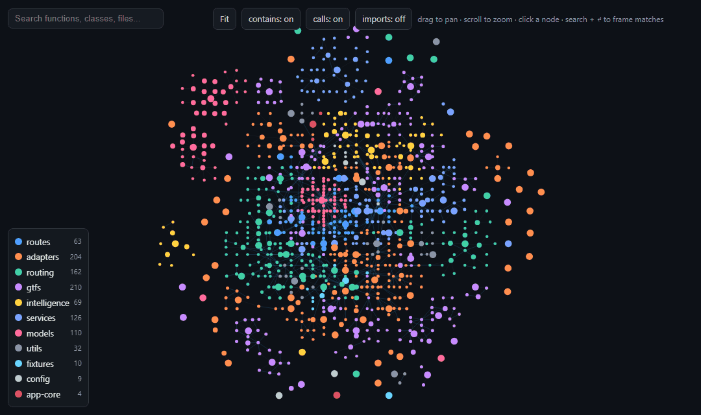
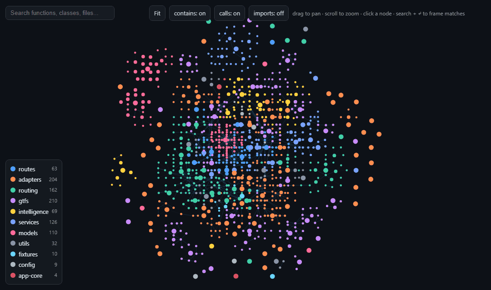

# ArchMap

**Offline, interactive, function-level architecture maps for any Python codebase.**

One command turns a Python package into a single self-contained HTML file: a
pannable, zoomable graph of every module, class, function and method, wired with
`calls` / `imports` / `contains` edges. Click any node to see its signature,
docstring, source, a deep-link into VS Code, and its neighbours. An optional AI
panel describes any node using a local model or your Claude subscription — and
**the API key never touches the browser**.




<sub>Recorded on a ~1,000-node Python backend. Regenerate the demos anytime with `python docs/record_demos.py`.</sub>

## Why

Most code-graph tools either execute your imports (unsafe, flaky), pull in a
heavy graph stack, or stop at the module level. `archmap` reads the code with
Python's own `ast` — nothing is imported or run — and resolves the graph down to
individual functions and methods. The output is one HTML file you can open from
`file://`, commit as an artifact, or hand to a teammate. No server, no CDN, no
build step required just to look at it.

## Features

- **Function-level graph from pure AST** — no imports executed, safe on any repo.
- **Single self-contained HTML** — data, CSS and JS inlined; opens offline.
- **Zero dependencies** — Python standard library only (3.9+).
- **High-precision call edges** — a `calls` edge is drawn only when it resolves
  to exactly one definition (`self.method`, an imported symbol, or a
  project-unique name). Dynamic dispatch and ambiguous same-named calls are
  skipped rather than guessed — a missing edge beats a fabricated one.

**Layer colouring & filtering** — nodes are grouped and coloured by architectural
layer; the legend toggles whole layers, top pills toggle `contains` / `calls` /
`imports`.



**Explore any node** — click for the signature, docstring, source snippet, a VS
Code deep-link, and its `calls` / `called-by` / `contains` neighbours; click a
neighbour to jump there.


- **Optional AI descriptions, key-safe** — proxied server-side so no secret ever
  reaches the page. Works with a local model or your Claude Code subscription.

## Requirements

- **Python 3.9+** (uses `ast.unparse`). No third-party packages.
- Optional, only for the AI panel:
  - the [`claude`](https://docs.claude.com/en/docs/claude-code) CLI on `PATH`
    (for the "Claude Code" provider — uses your Pro/Max login, no API credits), or
  - a local model server ([Ollama](https://ollama.com),
    [LM Studio](https://lmstudio.ai), llama.cpp, vLLM), or
  - an `ANTHROPIC_API_KEY` (for the metered Anthropic API).

## Quick start

```bash
git clone https://github.com/<you>/archmap.git
cd archmap

# Build the map for your package (graph only, fully offline):
python -m archmap --scan src --out archmap.html

# Open it — double-click, or:
python -m http.server   # then browse to archmap.html
```

> **Inside a larger monorepo?** If the package lives at `tools/archmap/`, invoke
> it as `python -m tools.archmap` (adjust the module path to wherever it sits).

## Usage

### Build the graph (`python -m archmap`)

| Flag                   | Default        | Meaning                                                  |
| ---------------------- | -------------- | -------------------------------------------------------- |
| `--scan DIR [DIR ...]` | `src`          | Source roots to scan, relative to the current directory. |
| `--out PATH`           | `archmap.html` | Output HTML path.                                        |
| `--iterations N`       | `320`          | Force-layout relaxation steps (higher = tidier, slower). |

```bash
python -m archmap --scan mypkg
python -m archmap --scan pkg_a pkg_b --out map.html --iterations 500
```

Pass `--scan` / `--out` explicitly for your project, or change the defaults
in `__main__.py` (see [Adapting to your project](#adapting-to-your-project)).

### Navigate the map

- **Pan** drag · **zoom** scroll · **click** a node for its side panel.
- **Search** highlights matching functions/files; the **legend** (bottom-left)
  toggles whole layers; the top pills toggle `contains` / `calls` / `imports`.
- The side panel shows the signature, docstring, source snippet, VS Code
  deep-link, and the node's **Calls / Called by / Contains** neighbours (click to
  jump). Drag the divider to widen the panel.

### AI descriptions (`python -m archmap.serve`)

The graph is fully offline, but the **Describe with AI** button needs the local
server so the provider key stays server-side:

```bash
python -m archmap.serve            # builds, serves http://localhost:8777, opens a browser
python -m archmap.serve --port 9000 --no-open
python -m archmap.serve --no-build # serve an already-built HTML as-is
```

The page POSTs the node's source to the **same-origin** server, which reads the
key from the environment / a local `.env` and calls the provider. **No key is
ever placed in the browser.** The server binds to `127.0.0.1` only.

_Describe with AI_ works on **any** node — functions, methods, classes, and whole
modules (a module hands the model its path, docstring and member list). It's
**one running conversation** that persists as you click between nodes, so context
accumulates; the **/clear** button empties it.

Pick the provider under _AI settings_ (model + local base URL are remembered
per-provider in `localStorage`):

| Provider                   | Billing                                               | Server needs           | Notes                                                                                                                           |
| -------------------------- | ----------------------------------------------------- | ---------------------- | ------------------------------------------------------------------------------------------------------------------------------- |
| **Claude Code** (default)  | your Claude Code login (Pro/Max) — **no API credits** | `claude` CLI on `PATH` | Keeps a **live session** (`claude --input-format stream-json`), so context is reused without resending and slash commands work. |
| **Ollama**                 | free / local                                          | Ollama running         | Called directly — no `OLLAMA_ORIGINS` needed. Reads `OLLAMA_HOST`.                                                              |
| **OpenAI-compatible**      | depends on server                                     | a local server         | LM Studio `:1234`, llama.cpp, vLLM. Reads `OPENAI_API_KEY` / `OPENAI_COMPAT_KEY`, `OPENAI_BASE_URL`.                            |
| **Claude (Anthropic API)** | metered API credits (separate from Pro)               | `ANTHROPIC_API_KEY`    | Direct API, stateless. Default model `claude-haiku-4-5-20251001`.                                                               |

#### Claude Code: live session + slash commands

The Claude Code provider keeps **one persistent `claude` process** alive
server-side (endpoint `/session`) for the life of the server. Because it's a real
Claude Code session you can type control commands straight into the chat box:

- **`/compact`** — summarise the running context (also a toolbar button).
- **`/context`**, **`/usage`**, etc.
- **/clear** (toolbar) or `/session {action:"reset"}` empties the thread and
  starts fresh.

Notes: it runs as a full Claude Code agent in the working directory (it can read
repo files, which makes answers richer but each turn slower); **changing the
model starts a new session** (context can't carry across models); and
`ANTHROPIC_API_KEY` is stripped from the child process so it uses the
subscription even if that variable is set. The other providers are stateless —
the browser replays the visible history each turn.

### Environment variables (AI only)

Read server-side from the environment or a `.env` in the working directory
(existing environment always wins):

```
ANTHROPIC_API_KEY   # Anthropic API provider
OLLAMA_HOST         # override Ollama base URL (default http://localhost:11434)
OPENAI_BASE_URL     # OpenAI-compatible base URL (default http://localhost:1234)
OPENAI_API_KEY      # or OPENAI_COMPAT_KEY — bearer for the OpenAI-compatible server
ANTHROPIC_BASE_URL  # override the Anthropic API base
```

## How it works

```
python -m archmap.serve
  ├─ extract.py  AST  → nodes (module/class/function/method) + edges (contains/imports/calls)
  ├─ layout.py   force-directed layout (grid-bucketed repulsion, per-layer gravity), baked into (x,y)
  ├─ render.py   inline data + CSS + JS → one self-contained HTML file
  └─ serve.py    static files + /chat (stateless providers) + /session (live Claude Code) proxy
```

- **`extract.py`** — walks each file's AST. Call resolution is a deliberate,
  high-precision second pass (see the module docstring): `self.method` → sibling,
  `from mod import name` → that symbol, otherwise a project-_unique_ simple name.
  Ambiguous `obj.attr()` is skipped so builtins like `dict.items` never fabricate
  edges.
- **`layout.py`** — a small Fruchterman–Reingold implementation with a spatial
  hash, so the O(n²) repulsion collapses to near-linear for ~1k nodes. Same-layer
  nodes share a gravity anchor, so the drawing clusters by layer with no separate
  grouping pass. Deterministic (fixed seed).
- **`render.py`** — serialises the graph into one HTML template; the viewer is a
  pure `<canvas>` renderer (pan/zoom, hit-testing, the side panel, and the AI
  chat client).
- **`serve.py`** / **`live_session.py`** — the localhost server and a thread-safe
  wrapper around one persistent `claude` stream-json process.

## Adapting to your project

### Layers — automatic by default

archmap derives layers from your directory structure — no configuration needed.

The algorithm is two-pass for good granularity:

1. **First directory under the scan root** is the default layer
   (`src/models/user.py` → `models`, `src/routes/auth.py` → `routes`).
2. **Auto-split on broad containers**: if a first-level directory has 3 or more
   immediate subdirectories that contain Python files, it is split one level
   deeper — so a large `services/` subtree becomes `adapters`, `routing`,
   `payments`, etc. rather than collapsing everything into one `services` bucket.
   Files that live directly inside that directory (e.g. `services/base.py`) keep
   the first-level name.

```
python -m archmap --scan src

  src/models/user.py        → models
  src/routes/auth.py        → routes
  src/services/auth.py      → services  (file directly in services/)
  src/services/payments/    → payments  (services/ has 3+ subdirs → split)
  src/services/shipping/    → shipping
  src/services/inventory/   → inventory
```

Files directly in the scan root (e.g. `src/main.py`) use the root name itself.
Colours are assigned automatically from a 36-colour built-in palette —
collision-free up to 36 layers, no configuration required.

### Manual layer rules (optional)

Add entries to `_LAYER_RULES` in `extract.py` when you want finer-grained
grouping than the auto-detect provides — for example, to split a large
`services/` subtree into distinct layers by concern:

```python
# extract.py — _LAYER_RULES (longest prefix first wins)
_LAYER_RULES: list[tuple[str, str]] = [
    ("src/services/payment",  "payments"),
    ("src/services/auth",     "auth"),
    ("src/services",          "services"),   # everything else under services/
    ("src/models",            "models"),
    ("src/api",               "api"),
]
```

Rules are checked in order, longest-prefix-first. Anything not matched falls
back to auto-detection, so you can override just the layers you care about and
leave the rest automatic.

### Layer colours (optional)

Auto-assigned colours are distinct and deterministic. To pin a specific colour
to a layer, add an entry to `_LAYER_COLORS` in `render.py`:

```python
_LAYER_COLORS: dict[str, str] = {
    "payments": "#41d0a5",
    "auth":     "#ffd23f",
}
```

Layers absent from `_LAYER_COLORS` continue to get auto-assigned colours from
the palette.

### Scan roots — pointing archmap at your code

Pass `--scan` with the directories that contain your Python source, relative to
where you run the command. Common layouts:

```bash
# src/ layout (PEP 517 / modern packaging)
python -m archmap --scan src

# top-level package
python -m archmap --scan mypackage

# multiple roots — e.g. app + separate config package
python -m archmap --scan app config

# monorepo: two sibling packages
python -m archmap --scan packages/auth packages/billing

# scan everything from the repo root (broad; picks up tests too)
python -m archmap --scan .
```

`serve.py` accepts the same `--scan` flag so the two commands stay in sync:

```bash
python -m archmap --scan mypackage --out map.html
python -m archmap.serve --scan mypackage
```

The default is `--scan src`. If your source isn't under `src/`, always pass
`--scan` explicitly.

## Project structure

```
archmap/
├── __main__.py       # build-only CLI:  python -m archmap
├── extract.py        # AST → nodes + edges (high-precision call resolution)
├── layout.py         # force-directed layout, baked into node coordinates
├── render.py         # inline data + CSS + JS → self-contained HTML (+ the viewer/AI client)
├── serve.py          # localhost server: static files + AI proxy (/chat, /session)
├── live_session.py   # persistent Claude Code stream-json session wrapper
├── docs/
│   ├── record_demos.py   # Playwright + Pillow: regenerate the README GIFs (dev-only)
│   └── *.gif             # the demo GIFs above
└── README.md
```

> The demo GIFs are the only thing that needs extra packages, and only to
> **regenerate** them: `pip install playwright pillow && python -m playwright
install chromium`, then `python docs/record_demos.py` (build the map first).
> The tool itself stays zero-dependency.

## Privacy & security

- The page makes **no network calls** except the optional AI request, and that
  request goes only to the same-origin local server.
- Keys are read server-side from the environment / `.env`; they are **never**
  sent to the browser. The server binds to `127.0.0.1`.
- Local providers and Claude Code keep your source **on your machine**. The
  Anthropic API provider, by definition, sends the selected node's source to
  Anthropic — use a local provider if that matters.
- Extraction never imports or executes your code; it only parses it.

## License

MIT [LICENSE].
